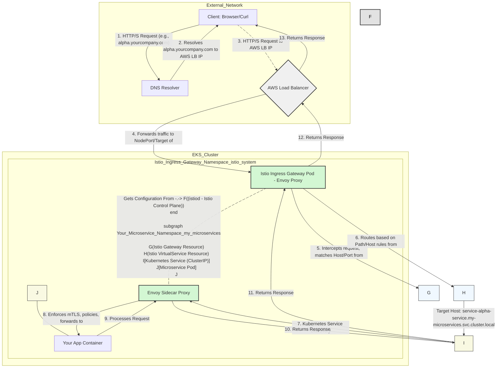

### Explanation of the Traffic Flow:

1.  **Client Request:** A user's browser or a `curl` command initiates an HTTP/S request for your public service, e.g., `alpha.yourcompany.com`.
2.  **DNS Resolution:** The client's DNS resolver looks up `alpha.yourcompany.com`. Your DNS records (e.g., a CNAME in AWS Route 53) are configured to point this hostname to the **AWS Load Balancer** associated with your Istio Ingress Gateway. The DNS resolver returns the Load Balancer's IP address/hostname to the client.
3.  **Connect to AWS Load Balancer:** The client then establishes an HTTP/S connection to the resolved IP address of the **AWS Load Balancer**.
4.  **AWS Load Balancer Forwards:** The AWS Load Balancer (which is `type: LoadBalancer` for the `istio-ingressgateway` Kubernetes Service) receives the request. It distributes this request to one of the healthy **Istio Ingress Gateway Pods** running in your EKS cluster (typically in the `istio-system` namespace).
5.  **Istio Ingress Gateway (Envoy):** The Envoy proxy inside the Ingress Gateway pod intercepts the request.
    *   It uses configuration pushed to it by `istiod` (the Istio Control Plane).
    *   It matches the incoming host (`alpha.yourcompany.com`) and port (80/443) against the rules defined in your **Istio Gateway Resource**.
6.  **VirtualService Routing:** Once the `Gateway` identifies the traffic, the Ingress Gateway then consults your **Istio VirtualService Resource** (e.g., `service-alpha-vs`). This `VirtualService` specifies the routing rules based on the host, path, headers, etc.
7.  **Kubernetes Service:** The `VirtualService`'s `destination` field specifies the target Kubernetes `Service` (e.g., `service-alpha-service.my-microservices.svc.cluster.local`). The Ingress Gateway routes the request to this `ClusterIP` Kubernetes Service.
8.  **Internal Load Balancing & Sidecar:** The Kubernetes Service, acting as a load balancer, selects a healthy pod that matches its selector (e.g., a pod running `service-alpha`). The request is then directed to that specific pod. Importantly, the request doesn't go directly to your application container, but rather to the **Envoy Sidecar Proxy** running alongside your application container in the *same pod*.
9.  **Sidecar Policies & Application:** The Envoy Sidecar in the microservice pod:
    *   Applies any `DestinationRule` policies (load balancing within the subset, connection pools, outlier detection, etc.).
    *   Enforces security policies (e.g., mutual TLS if configured, `AuthorizationPolicy`).
    *   Forwards the (potentially re-encrypted) request to your **Microservice Application Container** (e.g., on `localhost:8080`).
10. **Application Processing & Response:** Your application processes the request and generates a response. It sends this response back to its co-located **Envoy Sidecar**.
11. **Reverse Path (Sidecar to Ingress Gateway):** The Sidecar handles the outgoing response, applies any egress policies, and sends it back to the **Kubernetes Service**, which then routes it back to the **Istio Ingress Gateway**.
12. **Reverse Path (Ingress Gateway to Client):** The Ingress Gateway receives the response and sends it back to the **AWS Load Balancer**.
13. **Reverse Path (AWS LB to Client):** The AWS Load Balancer then forwards the final response back to the original **Client**.

### Key Istio Components in the Flow:

*   **`istiod` (Control Plane):** The "brain" that configures all the Envoy proxies (Ingress Gateway and sidecars) with the routing rules, security policies, and telemetry configurations defined in your Istio resources.
*   **Istio Ingress Gateway (Envoy Proxy):** The entry point to your mesh from outside, routing external traffic to internal services.
*   **Istio Gateway Resource:** Defines the L4-L6 properties (ports, hosts, TLS settings) for a specific ingress point (the `istio-ingressgateway` proxy).
*   **Istio VirtualService Resource:** Defines the L7 routing rules (HTTP path, headers, weights) from the `Gateway` to your Kubernetes Services.
*   **Envoy Sidecar Proxy:** Intercepts all inbound and outbound traffic for your application pod, enforcing policies, collecting telemetry, and enabling advanced traffic management and security within the mesh.

This flow highlights how Istio injects itself into the network path at multiple points to provide its powerful traffic management, security, and observability features.

---

Okay, let's visualize the traffic flow from a DNS request all the way to your microservice pod using Istio on an EKS cluster.

This diagram will illustrate the path for one of your publicly exposed services (e.g., `service-alpha` at `alpha.yourcompany.com`).

